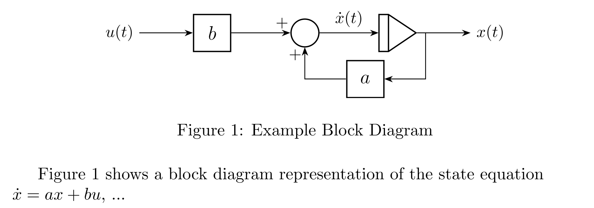

# TikZ Control Block Shapes

This library provides custom TikZ shapes and styles for creating control system block diagrams and state-space representations in LaTeX.  It was developed as part of a student project and aims to offer a convenient way to draw common control system elements.

## Features

* **Custom Shapes:**
    * `sum`: Summation block (circle with plus/minus signs).
    * `int`: Integrator block (trapezoid).
    * `mult`: Multiplier block (rectangle).
* **Basic Styling:**  Basic customization options are available for size, line thickness, and font.
* **Positioning:** Compatible with the `positioning` library for node placement.

## Installation

1. **Download:** Download the `tikzcontrolshapes.tex` and `tikzcontrolstyles.tex` files.
2. **Include in Your Document:** Add the following lines to your LaTeX document's preamble:

```latex
\usepackage{tikz}
\usetikzlibrary{positioning, calc, arrows.meta, shapes.geometric}
\input{tikzcontrolshapes}
\input{tikzcontrolstyles}

\documentclass[tikz, border=3pt]{standalone}
% ... (required libraries and input commands as above)

\begin{document}
\begin{tikzpicture}[>=Stealth, node distance=1.5cm and 2cm, on grid]
    \node[sum, sum signs={west=+, north=-}] (sum1) {};
    \node[int, right=of sum1] (int1) {};
    \node[mult, right=of int1] (mult1) {$K$};

    \draw[->] (sum1) -- (int1);
    \draw[->] (int1) -- (mult1);
\end{tikzpicture}
\end{document}
```

## Customization

You can customize the appearance of the blocks using standard TikZ options within the node definitions. For example:

```latex
\node[mult, fill=blue!20, minimum width=2cm, text=red] (mult2) {Gain};
```

## Available Styles

* **`mult`:** Multiplier block. Defaults:
    * `minimum width = 0.8cm`
    * `minimum height = 0.8cm`
    * `draw`
    * `thick`
    * `font = \large`
    * `inner sep = 0pt`
    * `align = center`

* **`sum`:** Summation block. Defaults:
    * `minimum size = 0.6cm`
    * `draw`
    * `thick`
    * `circle`
    
    Use the `sum signs` key to place "+" and "-" symbols around the node.

* **`int`:** Integrator block. Defaults:
    * `minimum width = 1cm`
    * `minimum height = 0.8cm`
    * `draw`
    * `thick`

    Use the key `integrator reversed=true` for a left-facing integrator.
    
    Currently, you must specify anchors (e.g., `.west`, `.east`) for connections to the `int` block.  Automatic anchor placement is not yet supported.

**`sum signs` key:**

The `sum signs` key is used to add plus/minus signs around the `sum` block.  Specify the signs for each compass direction (north, south, east, west, north east, north west, south east, south west).  Example:

```latex
\node[sum, sum signs={west=+, north=-, south=+}] (sum_example) {};
```

## Example

### block-diagram.png


### `main.tex` file
```latex
\documentclass{article}
\usepackage{tikz}
\usepackage{standalone} % Required for \includestandalone
\usetikzlibrary{positioning, calc, arrows.meta, shapes.geometric}

\input{TikZ-custom-shapes/tikzcontrolshapes}
\input{TikZ-custom-shapes/tikzcontrolstyles}

\begin{document}
\begin{figure}[h]
    \centering
    \includestandalone[width=0.7\textwidth]{block-diagram} % Replace 'block-diagram' with the actual filename of your standalone TikZ figure
    \caption{Example Block Diagram}
    \label{fig:block-diagram}
\end{figure}
Figure \ref{fig:block-diagram} shows a block diagram representation of the state equation $\dot{x} = ax + bu$, ...  % Example of cross-referencing 
\end{document}
```

### `block-diagram.tex` file
```latex
\documentclass[tikz, border=3pt]{standalone}
\usepackage{tikz}
\usetikzlibrary{positioning, calc, arrows.meta, shapes.geometric}
\input{TikZ-custom-shapes/tikzcontrolshapes}
\input{TikZ-custom-shapes/tikzcontrolstyles}

\begin{document}
\begin{tikzpicture}[>=Stealth, node distance=1.5cm and 2cm, on grid]
    % Input
    \node (input) {$u(t)$};
    
    % Blocks
    \node[mult, right=of input] (b) {$b$};
    \node[sum, right=of b, sum signs={west=+, south=+}] (sum) {};
    \node[int, right=of sum] (integrator) {};
    \node[mult, below left=1cm and 0.7cm of integrator] (a) {$a$};
    \node[right=of integrator] (output) {$x(t)$};
    
    % Feedback connection
    \coordinate (feedback) at ($(integrator)!0.3!(output)$);

    % Lines with arrows
    \draw[->] (input) -- (b);
    \draw[->] (b) -- (sum);
    \draw[->] (sum) -- node[midway, above] {$\dot{x}(t)$} (integrator.west);
    \draw[->] (integrator.east) -- (output);
    \draw[->] (feedback) |- (a);
    \draw[->] (a) -| (sum);
\end{tikzpicture}
\end{document}
```

## Feedback and Contributions

This library is provided as-is and feedback or suggestions for improvement are more than welcome. If you encounter any issues or have ideas for enhancements, please open an issue on GitHub. Contributions are also welcome via pull requests.

## License

This project is licensed under the MIT License - see the [LICENSE](LICENSE) file for details.